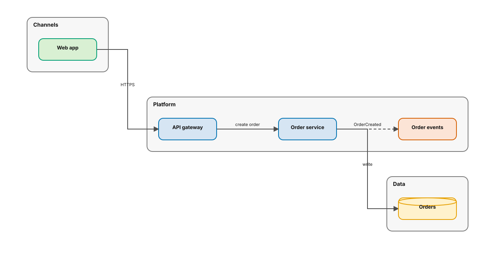
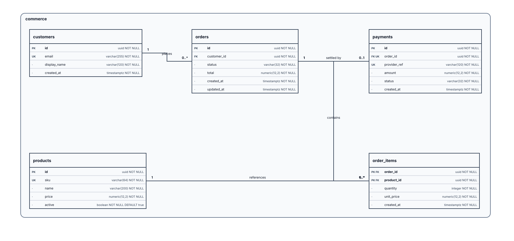
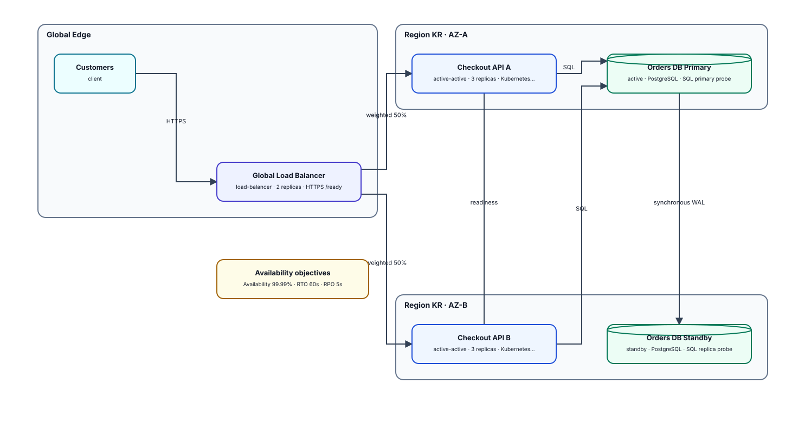
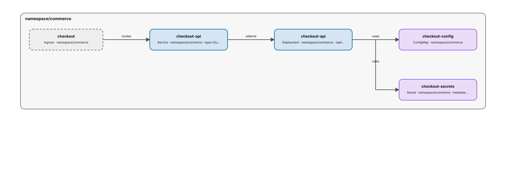
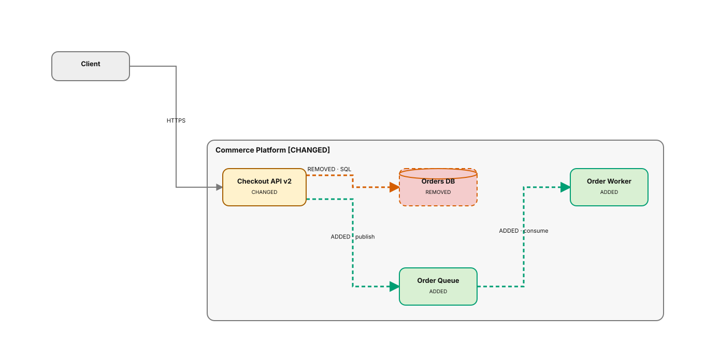
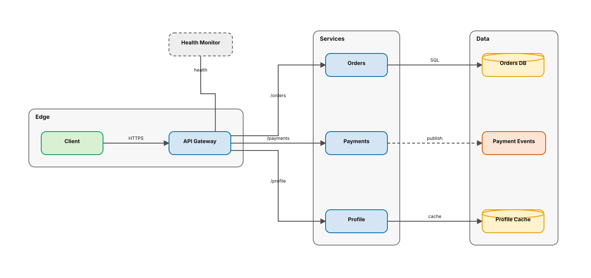

# drawio-skills

An open-source, deterministic diagram engineering skill for AI coding agents.

`drawio-diagram-engineer` turns a compact Diagram IR into editable `.drawio` XML, validates the result with a measurable quality gate, and exports through draw.io Desktop when available. The project is intentionally compiler-oriented: the structured IR is reviewable source, and `.drawio` is a reproducible build artifact.

> Status: **v1.4**. The stable Diagram IR v1 contract now includes composable policy packs, auditable expiring exceptions, accountable finding ownership, source provenance, and pull-request summaries, while retaining ERD, HA, round-trip editing, native export verification, security gates, and signed-release controls.



## Why another draw.io skill?

[Agents365-ai/drawio-skill](https://github.com/Agents365-ai/drawio-skill) is an excellent broad toolbox and a key inspiration for this project. This repository explores a different center of gravity:

- **IR-first:** natural language and future code/IaC importers target one versioned schema.
- **Deterministic:** semantic IDs and stable layout make diffs and regeneration predictable.
- **Quality-gated:** structural defects and layout collisions produce machine-readable findings and a 0–100 score.
- **Agent-portable:** the core JSON workflow uses only the Python standard library.
- **Safe evolution:** the editable source and generated artifact can be reviewed independently.

This is an independent implementation. No source code from the inspiration repository is included.

## Five-minute quick start

```bash
git clone https://github.com/uulab-official/drawio-skills.git
cd drawio-skills
python3 scripts/install_skill.py
python3 skills/drawio-diagram-engineer/scripts/drawio_tool.py doctor
```

Create a starter, edit the JSON to describe your system, and build the complete deliverable:

```bash
python3 skills/drawio-diagram-engineer/scripts/drawio_tool.py \
  init architecture -o my-system.json

python3 skills/drawio-diagram-engineer/scripts/drawio_tool.py \
  build my-system.json -o build/my-system --strict
```

The bundle is ready to review or commit:

```text
build/my-system/
├── my-system.drawio   # editable diagram
├── diagram.json       # normalized Diagram IR
├── previews/          # dependency-free SVGs, one per page
├── audit.json         # quality score, findings, and repairs
├── security.json      # credentials, unsafe links, and XML safety gate
└── bundle.json        # stable artifact manifest
```

Use `init blueprint`, `init erd`, or `init ha` for an architecture definition pack, database model, or HA/failover design. SQL DDL works without a starter:

```bash
python3 skills/drawio-diagram-engineer/scripts/drawio_tool.py \
  build schema.sql -o build/database --strict
```

Desktop-quality PNG/SVG/PDF/JPG export requires [draw.io Desktop](https://github.com/jgraph/drawio-desktop). The core bundle workflow does not. Native output is structurally verified before `render` succeeds:

```bash
python3 skills/drawio-diagram-engineer/scripts/drawio_tool.py \
  render build/my-system/my-system.drawio -o my-system.png \
  --report my-system.export.json
```

Use `verify-export` to validate an artifact made on another machine. See the [Desktop export contract](skills/drawio-diagram-engineer/references/desktop-export.md).

## Round-trip draw.io editing

Generated `.drawio` files carry versioned semantic metadata for pages, groups, nodes, edges, ERD fields, cardinalities, HA relationships, and cross-page links. Move, rename, reconnect, or restyle supported elements in draw.io, then recover reviewable Diagram IR:

```bash
python3 skills/drawio-diagram-engineer/scripts/drawio_tool.py \
  extract architecture.drawio \
  -o architecture.diagram.json \
  --report architecture.extraction.json \
  --strict
```

`lossless: true` means every semantic page and cell was recovered from supported compiler metadata. Older or hand-authored files are still converted using deterministic shape, style, geometry, and containment inference; strict mode exits `3` so those assumptions cannot silently enter source control. See the [round-trip editing contract](skills/drawio-diagram-engineer/references/round-trip.md).

## Portable collaborative review

Turn any complete bundle into a script-free HTML/SVG review site:

```bash
python3 skills/drawio-diagram-engineer/scripts/drawio_tool.py \
  publish build/my-system \
  -o build/my-system-review \
  --strict
```

The site provides multi-page navigation, stable semantic links such as `#node-api-gateway`, audit/security/extraction/export status, machine-readable evidence, reviewer-decision lifecycle, composed policy evaluation, owner-routed SARIF, source provenance, and a Markdown check summary. It opens locally and requires neither draw.io Desktop nor a web service.

Carry reviewer decisions across regeneration and apply accepted/resolved updates by stable annotation ID:

```bash
python3 skills/drawio-diagram-engineer/scripts/drawio_tool.py \
  publish build/my-system \
  -o build/my-system-review-v2 \
  --carry-review build/my-system-review \
  --annotations review-updates.json \
  --strict
```

Compose organization and team policy packs, route findings, and fail only on explicit gates:

```bash
python3 skills/drawio-diagram-engineer/scripts/drawio_tool.py \
  publish build/my-system \
  -o build/my-system-review \
  --policy organization-policy.json \
  --policy team-policy.json \
  --ownership review-ownership.json \
  --evaluation-date 2026-07-29 \
  --fail-on-policy \
  --fail-on-unowned-findings \
  --strict
```

Scoped exceptions record a reason, owner, expiry, and optional page/cell selectors. Waived rules remain visibly non-compliant, and expired error-level exceptions block policy. Every site includes `reports/policy.json`, `reports/ownership.json`, `reports/summary.md`, and SARIF 2.1.0 `reports/findings.sarif`. A [pinned GitHub Pages workflow recipe](skills/drawio-diagram-engineer/assets/github-pages-workflow.yml) appends the summary to the job, retains an immutable `diagram-review-<commit-sha>` artifact, and deploys the same evidence directory.

Use an approved review site or bundle as a deterministic visual baseline:

```bash
python3 skills/drawio-diagram-engineer/scripts/drawio_tool.py \
  publish build/my-system \
  -o build/my-system-review \
  --baseline approved-review \
  --fail-on-visual-change
```

Exit code `7` means at least one page was added, removed, or changed; exit code `8` means an error-level architecture policy failed; exit code `9` means the explicit ownership gate found an unassigned finding. The diagnostic site is still written for CI retention. See the [collaborative review contract](skills/drawio-diagram-engineer/references/collaborative-review.md), [governance annotation example](skills/drawio-diagram-engineer/assets/example.governance-annotations.json), [composable policy examples](skills/drawio-diagram-engineer/assets/policies), and [ownership example](skills/drawio-diagram-engineer/assets/example.ownership.json).

Open the checked-in [Commerce Platform review site](docs/review/index.html) or inspect its [machine-readable review manifest](docs/review/review.json).

## Architecture blueprint pack

Generate six coordinated architecture pages—System Context, Logical Architecture, Data Flow, Deployment, Network & Security, and Architecture Decisions—from one model:

```bash
python3 skills/drawio-diagram-engineer/scripts/drawio_tool.py \
  blueprint skills/drawio-diagram-engineer/assets/example.blueprint.json \
  -o commerce-blueprint.drawio \
  --ir-output commerce-blueprint.diagram.json \
  --preview-dir commerce-blueprint-previews \
  --strict
```

The model uses hierarchy, bounded domains, deployment mappings, and security zones to project each view without duplicating its source of truth. See the [Blueprint reference](skills/drawio-diagram-engineer/references/blueprint.md).

Preview the generated pages: [Context](docs/blueprint/context.svg), [Logical](docs/blueprint/logical.svg), [Data](docs/blueprint/data.svg), [Deployment](docs/blueprint/deployment.svg), [Network & Security](docs/blueprint/security.svg), and [Architecture Decisions](docs/blueprint/decisions.svg).

The complete example pack is available as an [editable draw.io file](docs/blueprint/commerce-platform.drawio), [generated Diagram IR](docs/blueprint/commerce-platform.diagram.json), and [100-point audit report](docs/blueprint/audit.json).

## Crow's Foot ERD

Generate a field-level ERD from the structured model or directly from SQL DDL:

```bash
python3 skills/drawio-diagram-engineer/scripts/drawio_tool.py \
  erd skills/drawio-diagram-engineer/assets/example.erd.json \
  -o commerce-erd.drawio \
  --ir-output commerce-erd.diagram.json \
  --preview-dir commerce-erd-previews \
  --strict
```

The ERD profile validates primary and foreign keys, composite-key field order, data-type compatibility, nullable/unique flags, and endpoint cardinalities. The editable output uses official draw.io Crow's Foot markers. See the [ERD reference](skills/drawio-diagram-engineer/references/erd.md).

Open the [editable ERD](docs/erd/commerce-erd.drawio), [generated IR](docs/erd/commerce-erd.diagram.json), [SVG preview](docs/erd/main.svg), or [100-point audit](docs/erd/audit.json).



## High-availability architecture

Generate separate HA topology and failover views:

```bash
python3 skills/drawio-diagram-engineer/scripts/drawio_tool.py \
  ha skills/drawio-diagram-engineer/assets/example.ha.json \
  -o checkout-ha.drawio \
  --ir-output checkout-ha.diagram.json \
  --preview-dir checkout-ha-previews \
  --strict
```

The HA profile validates independent failure domains, replica counts, quorum shape, stateful replication, automatic-failover health checks, cross-domain promotion, RTO, and RPO. See the [HA reference](skills/drawio-diagram-engineer/references/ha.md).

Open the [editable HA pack](docs/ha/checkout-ha.drawio), [generated IR](docs/ha/checkout-ha.diagram.json), [topology](docs/ha/topology.svg), [failover flow](docs/ha/failover.svg), or [100-point audit](docs/ha/audit.json).



## Infrastructure and pipeline intelligence

Generate editable topology directly from Terraform, Kubernetes, GitHub Actions, or GitLab CI:

```bash
python3 skills/drawio-diagram-engineer/scripts/drawio_tool.py \
  import ./infra --type terraform -o terraform.diagram.json

python3 skills/drawio-diagram-engineer/scripts/drawio_tool.py \
  import ./manifests --type kubernetes -o kubernetes.diagram.json

python3 skills/drawio-diagram-engineer/scripts/drawio_tool.py \
  import . --type github-actions -o delivery.diagram.json
```

Terraform references become dependency edges. Kubernetes namespaces become groups, with Ingress → Service → workload and workload → configuration/storage relations derived from declared selectors and references. Secret values are redacted. CI jobs are grouped by workflow or stage and ordered from prerequisite to dependent job.

See the complete [importer contract](skills/drawio-diagram-engineer/references/importers.md), the 20-case [infrastructure/CI corpus](tests/fixtures/importers/corpus.json), and the 25-case [legacy importer corpus](tests/fixtures/importers/legacy-corpus.json). Every importer now has at least five deterministic strict-valid fixtures.

Open the editable and audited examples:

- [Terraform diagram](docs/infrastructure/terraform/infrastructure.drawio), [SVG](docs/infrastructure/terraform/main.svg), and [100-point audit](docs/infrastructure/terraform/audit.json).
- [Kubernetes diagram](docs/infrastructure/kubernetes/runtime.drawio), [SVG](docs/infrastructure/kubernetes/main.svg), and [100-point audit](docs/infrastructure/kubernetes/audit.json).
- [GitHub Actions](docs/pipelines/github-actions/pipeline.drawio) and [GitLab CI](docs/pipelines/gitlab-ci/pipeline.drawio), each with a generated SVG and 100-point audit.



## Semantic architecture drift

Compare two Diagram IR versions while ignoring layout-only movement:

```bash
python3 skills/drawio-diagram-engineer/scripts/drawio_tool.py \
  diff approved.diagram.json generated.diagram.json \
  -o drift.report.json \
  --diagram-output drift.drawio \
  --preview-dir drift-previews \
  --fail-on-drift
```

The report classifies page, group, node, and edge changes by stable semantic ID. The editable view uses green for additions, red dashed shapes for removals, and amber for changes, with text status markers for non-color-only review. See the [drift contract](skills/drawio-diagram-engineer/references/drift.md), [example report](docs/drift/report.json), [editable view](docs/drift/architecture-drift.drawio), [SVG preview](docs/drift/main.svg), and [100-point audit](docs/drift/audit.json).



## Deterministic ports and routing

Automatic edges select the side facing their target, distribute fan-out/fan-in attachment points, and choose an orthogonal corridor by node intersections, unrelated edge crossings, bend count, and length. Assign a fixed interface only when the topology requires it:

```json
{
  "id": "monitor-api",
  "from": "monitor",
  "to": "api",
  "style": {
    "source_port": "south",
    "source_offset": 0.5,
    "target_port": "north",
    "target_offset": 0.75
  }
}
```

The generated draw.io file contains editable waypoints, while the SVG preview and validator consume the same route plan. See the [routing contract](skills/drawio-diagram-engineer/references/routing.md), [source IR](skills/drawio-diagram-engineer/assets/example.routing.json), [editable example](docs/routing/checkout-routing.drawio), [SVG preview](docs/routing/main.svg), and [100-point audit](docs/routing/audit.json).



## Organization themes and visual audit

Apply a reusable theme pack and generate a machine-readable QA report:

```bash
python3 skills/drawio-diagram-engineer/scripts/drawio_tool.py \
  audit skills/drawio-diagram-engineer/assets/example.blueprint.json \
  -o commerce-blueprint.audit.json \
  --preview-dir commerce-blueprint-audit \
  --theme-file skills/drawio-diagram-engineer/assets/themes/corporate.json \
  --strict
```

The audit checks the source plus generated draw.io geometry for contrast, text density, clipping, overlap, and routing risks. It groups findings with targeted repair suggestions and a visual-review checklist. See the [style system reference](skills/drawio-diagram-engineer/references/style-system.md).

## Install as an agent skill

In Codex, ask the built-in skill installer to install the skill folder:

```text
$skill-installer install https://github.com/uulab-official/drawio-skills/tree/main/skills/drawio-diagram-engineer
```

For a cloned repository, the tested installer copies the skill, runs its self-check, and reports whether the agent must restart:

```bash
python3 scripts/install_skill.py
```

Use `--mode symlink` while developing the skill or `--target <skills-directory>` for another Agent Skills-compatible client. Existing installations are never replaced unless `--force` is explicit.

The distributable ZIP is reproducible:

```bash
python3 scripts/package_skill.py
```

This writes `dist/drawio-diagram-engineer.zip` and its `.sha256` checksum.

Tagged releases also include GitHub/Sigstore build provenance. Verify a downloaded ZIP with:

```bash
shasum -a 256 -c drawio-diagram-engineer-<version>.zip.sha256
gh attestation verify drawio-diagram-engineer-<version>.zip \
  --repo uulab-official/drawio-skills
```

Verify the release tag itself from a clone:

```bash
git fetch --tags origin
python3 scripts/verify_release_tag.py v1.0.0
```

The verifier requires an annotated SSH signature trusted by [.github/release-signers](.github/release-signers), confirms the tag subject, and matches the tag version against the tool, package metadata, and changelog. Published releases are immutable: their tag and assets cannot be changed while the release exists.

## Compatibility and security

Check or migrate an older unversioned Diagram IR before editing it:

```bash
python3 skills/drawio-diagram-engineer/scripts/drawio_tool.py \
  migrate legacy.json --check

python3 skills/drawio-diagram-engineer/scripts/drawio_tool.py \
  migrate legacy.json -o diagram.json --report migration.json
```

Scan a model, generated `.drawio`, or complete delivery bundle:

```bash
python3 skills/drawio-diagram-engineer/scripts/drawio_tool.py \
  security build/my-system -o build/my-system/security.json --strict
```

The security gate rejects likely embedded credentials, private keys, unsafe link schemes, DTD/entity declarations, and oversized compressed pages without echoing suspected secret values. HTTP/HTTPS/mail links are listed for review and never fetched. See the [compatibility policy](skills/drawio-diagram-engineer/references/compatibility.md) and [security contract](skills/drawio-diagram-engineer/references/security.md).

## Diagram IR

```json
{
  "version": "1",
  "diagram": {"title": "Payments", "direction": "LR", "theme": "colorblind"},
  "groups": [{"id": "platform", "label": "Platform"}],
  "nodes": [
    {"id": "api", "label": "API", "kind": "service", "group": "platform"},
    {"id": "ledger", "label": "Ledger", "kind": "database", "group": "platform"}
  ],
  "edges": [
    {"id": "api-ledger", "from": "api", "to": "ledger", "label": "write", "kind": "data"}
  ]
}
```

See [the IR reference](skills/drawio-diagram-engineer/references/ir-format.md) for supported fields.

## CLI

```text
drawio_tool.py doctor [--format human|json]
drawio_tool.py init <architecture|blueprint|erd|ha|routing|terraform|kubernetes|github-actions|gitlab-ci> [-o <starter>]
drawio_tool.py build <model|source> [-o <bundle-dir>] [--type auto|...] [--strict]
drawio_tool.py merge-annotations <prior-review|annotations> <updates> -o <merged.json>
drawio_tool.py publish <bundle-dir> -o <review-dir> [--annotations <json>] [--carry-review <review>] [--baseline <review|bundle>] [--policy <json>]... [--ownership <json>] [--source-revision <revision>] [--public-base-url <url>] [--fail-on-visual-change] [--fail-on-policy] [--fail-on-unowned-findings] [--strict]
drawio_tool.py migrate <legacy-ir.json> [-o <v1-ir.json>] [--report <report.json>] [--check]
drawio_tool.py security <model|diagram.drawio|bundle-dir> [-o <report.json>] [--strict]
drawio_tool.py compile <ir.json> -o <diagram.drawio> [--theme-file <theme.json>]
drawio_tool.py extract <diagram.drawio> -o <ir.json> [--report <report.json>] [--strict]
drawio_tool.py blueprint <blueprint.json> -o <pack.drawio> [--ir-output <ir.json>] [--preview-dir <dir>] [--theme-file <theme.json>]
drawio_tool.py erd <erd.json|schema.sql> -o <erd.drawio> [--ir-output <ir.json>] [--preview-dir <dir>]
drawio_tool.py ha <ha.json> -o <ha.drawio> [--ir-output <ir.json>] [--preview-dir <dir>]
drawio_tool.py import <source> --type <python|typescript|openapi|sql|compose|terraform|kubernetes|github-actions|gitlab-ci> -o <ir.json>
drawio_tool.py diff <baseline.ir.json> <candidate.ir.json> -o <report.json> [--diagram-output <drift.drawio>] [--preview-dir <dir>] [--fail-on-drift]
drawio_tool.py patch <ir.json> <operations.json> -o <updated.json>
drawio_tool.py preview <ir.json> -o <preview.svg> [--page <id>] [--theme-file <theme.json>]
drawio_tool.py audit <ir.json|blueprint.json|diagram.drawio> [-o <report.json>] [--preview-dir <dir>] [--strict]
drawio_tool.py validate <ir.json|diagram.drawio> [--strict]
drawio_tool.py inspect <diagram.drawio>
drawio_tool.py render <diagram.drawio> -o <output.png|svg|pdf|jpg> [--embed] [--binary <path>] [--report <report.json>]
drawio_tool.py verify-export <output.png|svg|pdf|jpg> [-o <report.json>]
```

JSON works without third-party packages. YAML input is optional and requires PyYAML.

`build` auto-detects Diagram IR, Blueprint, ERD, HA, SQL DDL, Terraform, common Kubernetes/OpenAPI/Compose documents, repository source, and supported CI definitions. It does not copy the input into the bundle, which avoids accidentally packaging Kubernetes Secret documents or proprietary source trees.

For every command and exit code, see the [CLI reference](skills/drawio-diagram-engineer/references/cli.md). For copy-paste workflows, bundle semantics, overwrite behavior, and troubleshooting, see the [user workflows guide](skills/drawio-diagram-engineer/references/user-workflows.md).

## Roadmap

The v0.1–v1.0 roadmap is complete. v1.1 added round-trip editing, v1.2 portable publication, v1.3 persistent policy review, and v1.4 team-scale governance with composable exceptions, ownership, provenance, and PR summaries. v1.5 tracks optional enterprise integrations without weakening the portable contract. See [ROADMAP.md](ROADMAP.md).

## Development

```bash
python3 -m unittest discover -s tests -v
python3 scripts/audit_repository.py
python3 ~/.codex/skills/.system/skill-creator/scripts/quick_validate.py \
  skills/drawio-diagram-engineer
```

See [CONTRIBUTING.md](CONTRIBUTING.md) before proposing a schema or output compatibility change.

### macOS Python note

If Homebrew Python fails to import `pyexpat` because its `libexpat` symbols do not match, use `/usr/bin/python3` temporarily or reinstall the affected Python/libexpat packages. This is an interpreter ABI problem; JSON-only compilation may appear to work until XML validation starts.

## License

Apache License 2.0. See [LICENSE](LICENSE).
